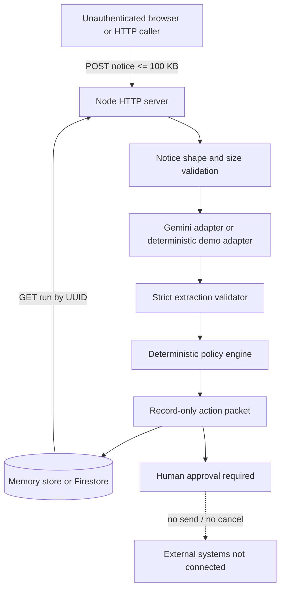

# Renewal Relay threat model

Review boundary: the checked-out Renewal Relay source and its synthetic public-demo deployment path. This is a source-only model; it does not assert that Cloud Run, Firestore, Gemini, IAM, or Secret Manager has been deployed or configured. The final reviewed commit is recorded in `docs/release-receipt.md`.

## Executive summary

Renewal Relay accepts one notice over HTTP, asks a bounded Gemini adapter (or the explicitly labeled deterministic demo adapter) for structured facts, evaluates a deterministic policy, and stores a run containing reversible action records. The system deliberately has no send, cancel, calendar, or task-provider credentials and requires human approval for financial commitment.

The highest-risk deployment condition is a public unauthenticated demo backed by Firestore: any caller can submit synthetic notices and consume request, model, and database capacity, and any caller who learns a run ID can read that run. This is acceptable only for the documented synthetic-data demo boundary. A production deployment with real notices requires authenticated access, rate limiting or quotas, tenant isolation, and a least-privilege data policy before enabling it.

The review found and fixed two application-boundary defects: request size is now enforced incrementally before buffering beyond 100,000 bytes, and HTTP run IDs are UUID-based and format-validated before a store lookup. Uniform browser security headers were also added. No external action path exists to approve, send, cancel, or mutate a vendor system.

## Scope and assumptions

In scope:

- `src/server.js`: HTTP parsing, API routing, run ID generation, static-file serving, and response headers.
- `src/ai/gemini-adapter.js`: model response schema and semantic validation.
- `src/agent/renewal-agent.js` and `src/domain/policy.js`: autonomous flow, policy boundary, and action metadata.
- `src/store/run-store.js`: memory/Firestore persistence boundary.
- `public/*`, `Dockerfile`, `.github/workflows/test.yml`, and the test/secret/runtime-check scripts.

Assumptions:

- The public demo uses synthetic ZenCloud data only, as stated in the README and UI.
- The demo may be unauthenticated for judge access; that is an explicit deployment trade-off, not an authentication claim.
- Cloud Run, Firestore, Gemini, Secret Manager, IAM, billing, and video evidence are external gates and remain unverified until a human performs them.
- Attackers can send arbitrary HTTP requests to a public demo and can place prompt-injection text in a submitted notice. They cannot read the repository's environment, Cloud project, service identity, or Secret Manager unless a separate configuration failure exposes them.
- There are no external calendar, task, mailbox, contract, or payment side effects in this code boundary.

## System model

Trust boundaries:

1. Internet caller to the unauthenticated HTTP service.
2. Caller-controlled notice text to the model prompt.
3. Model/provider output to the strict application validator.
4. Application process to optional Firestore and its Cloud Run service identity.
5. Staged records to a human approval decision; no downstream execution connector crosses this boundary.

## Assets and security objectives

| Asset | Objective | Current control | Residual concern |
| --- | --- | --- | --- |
| Notice body and extracted facts | Integrity and bounded confidentiality | Synthetic-only scope, bounded request size, strict model schema | Real notices must not use the public demo |
| Run/action packet | Integrity, replay safety, traceability | UUID run IDs, idempotency keys, source SHA-256, record-only metadata | Known IDs are readable if a public Firestore deployment is used without auth |
| Gemini API key and service identity | Confidentiality and least privilege | Environment/Secret Manager path, ignored `.env`, secret scanner, no key in responses | Cloud IAM configuration is not verifiable locally |
| Operator decision | Human control over financial commitment | `REVIEW_REQUIRED`, no auto-send/no auto-cancel, no provider credentials | UI is not an identity or approval system |
| Service availability and cost | Bounded resource use | Incremental 100 KB body cap, async run, CI checks | No auth/rate limit on the public demo |
| Browser execution context | No script injection or framing | Contextual escaping, `textContent`, CSP, `nosniff`, frame denial | A real production origin still needs platform-level headers and monitoring |

## Attacker model

An attacker may submit malformed JSON, oversized chunked requests, arbitrary notice text, arbitrary model-shaped content through a future adapter, guessed or malformed run paths, repeated requests, and HTML-like strings in fields displayed by the UI. They may inspect public responses and infer implementation details.

An attacker is not assumed to have shell access, repository write access, Cloud credentials, Secret Manager access, a valid operator identity, or permission to accept Devpost agreements. This model does not cover compromise of the host, Node.js runtime, Google Cloud control plane, dependency supply chain, or a human's own credentialed browser session.

## Entry points and attack surfaces

| Entry point | Trust level | Sink | Defensive boundary |
| --- | --- | --- | --- |
| `POST /api/runs` | Untrusted | JSON parser, async agent, memory/Firestore write | Incremental byte cap, required subject/body, no external actions |
| `GET /api/runs/<id>` | Untrusted | Memory/Firestore document lookup | UUID-shaped ID allow-list before lookup |
| `GET /api/demo`, `/api/health` | Public | JSON response | No secrets; provider label only |
| Static `GET` paths | Untrusted path | Filesystem read | Normalized path must remain below `public/` |
| Notice text in Gemini prompt | Untrusted content | Provider request | Bounded fields, structured JSON response, semantic validator |
| Model extraction | Provider output | Policy and action construction | Allow-listed fields, numeric/date bounds, fail closed |
| Cloud configuration | Operator-controlled | Gemini/Firestore clients | Secret indirection and service identity are documented; live IAM is a human gate |

## Top abuse paths

1. **TM-001 — request flood or body exhaustion:** a public caller repeatedly submits requests or a chunked body. The incremental cap fixes unbounded body accumulation; repeated accepted requests can still consume CPU, Gemini quota, memory, or Firestore writes.
2. **TM-002 — run read exposure:** a caller reads a known run ID. UUIDs remove timestamp enumeration and malformed IDs are rejected, but public unauthenticated reads remain a deployment-level risk for real data.
3. **TM-003 — prompt injection in notice text:** submitted text attempts to make the model invent facts or request actions. The model is only used for extraction, output is strictly validated, policy is deterministic, and action records are non-sendable.
4. **TM-004 — stored/reflected script injection:** attacker-controlled fields reach the browser. Dynamic HTML uses contextual escaping or `textContent`; CSP and framing controls provide defense in depth.
5. **TM-005 — Firestore path abuse:** an ID containing a slash or invalid document path reaches the SDK. The HTTP route now rejects IDs before `collection.doc()`.
6. **TM-006 — static path traversal:** encoded or relative path input attempts to escape `public/`. Normalized absolute paths are checked against the public root; URL path is not decoded into filesystem syntax.
7. **TM-007 — secret leakage:** a key is committed, printed, or returned by a health endpoint. `.env` is ignored, the scanner checks high-confidence formats without echoing values, runtime proof redacts credentials, and the service returns only provider metadata.
8. **TM-008 — accidental real-world side effect:** a model output or future integration silently sends/cancels. The current action factory hard-codes `execution: "record_only"`, `retrySafe: true`, and `sendable: false`; no action executor or provider credential exists.

## Threat register

| ID | Preconditions | Impact | Likelihood | Priority | Controls/evidence | Residual decision |
| --- | --- | --- | --- | --- | --- | --- |
| TM-001 | Public POST endpoint | Availability, quota, and possible Firestore cost | High on public internet | Medium | Incremental 100 KB cap in `src/server.js`; targeted oversized-body test | Before real data: require auth plus platform/app quota or keep memory-only synthetic demo |
| TM-002 | Public Firestore-backed GET and known ID | Confidentiality of a stored run | Medium | Medium | UUID generation and route allow-list; synthetic-only documentation | Do not deploy real notices unauthenticated; add identity/tenant authorization before production |
| TM-003 | Attacker controls notice text and Gemini is enabled | Incorrect extraction or unsafe routing | Medium | Low | `responseSchema`, `validateExtraction`, deterministic policy, fail-closed agent tests | Keep model out of policy and action authorization |
| TM-004 | Attacker-controlled text is rendered | Browser code execution | Low after controls | Low | `escapeHtml`, `textContent`, CSP, `X-Content-Type-Options`, `X-Frame-Options` | Re-test if UI rendering or external origins change |
| TM-005 | Invalid ID reaches Firestore | Error path, possible availability impact | Medium before fix | Low after fix | UUID-shaped route gate and malformed-ID regression test | Keep store APIs defensive if new callers are added |
| TM-006 | Crafted static URL | File disclosure | Low | Low | `normalize(join(PUBLIC, requested))` root containment check | Add decoded-path cases if routing starts decoding URLs |
| TM-007 | Misconfigured environment or repository | Credential compromise | Low in source boundary | Medium | Secret scanner, `.gitignore`, Secret Manager instructions, redacted runtime checker | Verify IAM and secret bindings during authorized deployment |
| TM-008 | Future action connector bypasses current factory | Financial or external side effect | Low in current code | High if introduced | No connector; `record_only`; human approval guardrails and tests | Treat any executor as a new security review gate |

## Criticality calibration

Priority is qualitative: `High` means an attacker can cause an irreversible external or financial effect or disclose real tenant data; `Medium` means meaningful availability, quota, cost, or confidentiality risk under a deployment precondition; `Low` means bounded impact with a validated control. The current application has no external side-effect sink, so TM-008 is a future-change gate rather than an active exploit.

For production promotion, use a simple expected-loss framing for the public endpoint: `E[L] = p_real × (C_data + C_action) + p_abuse × (C_quota + C_availability)`, where `p_real` is the probability that non-synthetic data is admitted, `p_abuse` is the probability of abusive traffic, and each `C` is the resulting cost. The current demo keeps `p_real` near zero by contract and accepts a non-zero `p_abuse` only for synthetic rehearsal. Authentication, quotas, and tenant-scoped authorization are required before those assumptions change.

## Evidence and engineering basis

| Claim | Evidence |
| --- | --- |
| Request validation should be bounded and allow-listed | [OWASP Input Validation Cheat Sheet](https://cheatsheetseries.owasp.org/cheatsheets/Input_Validation_Cheat_Sheet.html); `src/server.js`; `test/server.test.js` |
| Contextual output encoding and CSP reduce browser injection risk | [OWASP Cross Site Scripting Prevention Cheat Sheet](https://cheatsheetseries.owasp.org/cheatsheets/Cross_Site_Scripting_Prevention_Cheat_Sheet.html); [W3C CSP Level 3](https://www.w3.org/TR/CSP3/); `public/app.js`; `src/server.js` |
| Structured model output must still be validated by application code | [Gemini structured output documentation](https://ai.google.dev/gemini-api/docs/structured-output); `src/ai/gemini-adapter.js`; `test/agent.test.js` |
| Public Cloud Run access and service identity are separate deployment decisions | [Cloud Run authentication](https://cloud.google.com/run/docs/authenticating/overview); [Cloud Run service identity](https://cloud.google.com/run/docs/configuring/services/service-identity); `docs/human-action-pack.md` |
| Firestore reads must be constrained by identity/rules for real data | [Firestore security rules documentation](https://firebase.google.com/docs/firestore/security/get-started); `src/store/run-store.js`; `docs/human-gates.md` |

## Verification plan

The security boundary is accepted only when all of the following are true on the final commit:

- `npm test` passes, including oversized-body, malformed-ID, validator, fail-closed, and XSS/provenance regressions.
- `npm run check` and `git diff --check` pass.
- `npm run check:secrets` reports zero findings without echoing values.
- `npm audit --omit=dev` reports zero vulnerabilities for the production dependency tree.
- CI passes on the exact pushed commit.
- If a container is rebuilt, the image digest and smoke result are added to `docs/release-receipt.md`; this remains local/container evidence, not Cloud Run proof.

## Limitations and next gate

This is not a penetration test, a dependency CVE scan, a Cloud IAM review, a Firestore rules review, or proof of a live Gemini call. The next high-value gate is authorized deployment hardening: use a human-owned project, Secret Manager, least-privilege service identity, authenticated or explicitly bounded public access, and a live synthetic run whose URL/revision/provider/read-back evidence is recorded without secrets.
